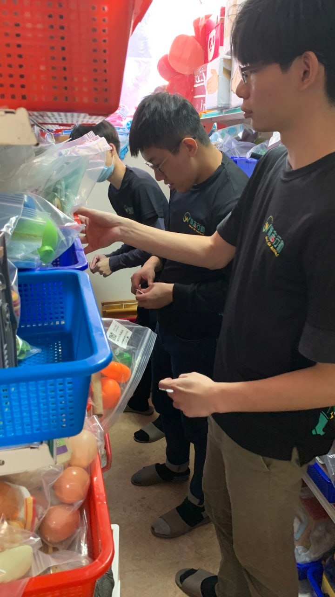

# 教育部青年發展署青年志工參與服務成果報告表
|學校/團體全銜|團隊名稱|計畫名稱|編號|申請類別|受服務單位|服務地點|實際志工人數|服務總時數|服務對象|
|------ |------ |------|------|------|------|------|------|------|------|
|中原大學|中原電機與玩具超人|早療兒童學習輔具管理與修復|002913|一般型服務計畫|心路基金會桃園分會的職員與兒童|桃園市平鎮區桃園市平鎮區環南路二段192巷1號|男：4人，女：2人，合計：6人|96 小時|總人數33人| 
### 實際執行時間
|日期|開始時間|結束時間|地點|備註|
|------ |------ |------|------|------|
|2024/3/8|14:00|16:00|心路基金會-心路桃園發展中心|
|2024/3/22|14:00|16:00|心路基金會-心路桃園發展中心|
|2024/3/29|14:00|16:00|心路基金會-心路桃園發展中心|原訂服務時間為4/5，但遇清明連假，故提前一週服務
|2024/4/19|14:00|16:00|心路基金會-心路桃園發展中心|
|2024/5/3|14:00|16:00|心路基金會-心路桃園發展中心|
|2024/5/17|14:00|16:00|心路基金會-心路桃園發展中心|
|2024/5/31|14:00|16:00|心路基金會-心路桃園發展中心|
|2024/6/14|14:00|16:00|心路基金會-心路桃園發展中心|

# 服 務 計 畫 成 果
## 一、志工訓練成果
在參加這次的志工服務之前，我們進行了一系列的志工訓練與行前規劃準備。這些訓練和準備工作不僅使我們更好地了解服務對象及其需求，還幫助我們掌握了實際操作中的各種技能。以下是我們在這次志工訓練中取得的具體成果：

**1. 培養團隊合作精神：**
在訓練中，我們進行了多次團隊合作的活動，這些活動增強了我們之間的默契和協作能力。比方說有些同學負責貼標籤、有些負責列印標籤、有些同學負責整理相關玩具。在實際服務過程中，這種團隊合作精神幫助我們高效地完成了各項工作，確保了服務的順利進行。

**2. 技能學習與應用：**
於訓練中，我們學習了如何有效地整理玩具、標籤的製作與貼附，以及玩具的基本維護知識。雖然在實際服務中，我們主要進行了玩具整理、貼標籤和列印標籤的工作，這些技能的學習使我們能夠有條不紊地完成每一項任務。

**3. 應對突發情況的能力：**
在訓練過程中，我們模擬了各種可能遇到的突發情況，並學習了相應的應對措施。這些訓練讓我們在實際服務中能夠從容應對各種挑戰，保持高效且有序的工作狀態。比方說，在訓練的某一天，我們假想了一個情境：當孩子們在玩具區域玩耍時，突然有一大堆玩具從架子上掉落，散落在地板上，造成了混亂。我們的志工立即分成兩組，一組負責安撫孩子，確保他們的安全和情緒穩定；另一組則迅速開始清理散落的玩具。

**4. 借還系統app的設計與調整 :**
我們在訓練中還學習了如何設計和使用借還系統app，這對於玩具的管理至關重要。
在實際應用過程中，我們收集了機構給予的反饋建議，進行了多次調整和微調，具體
包括以下幾個方面：

- 用戶界面的改進 :
  我們優化了app的界面設計，使其更加直觀易用。例如，將主要功能按鈕放置在顯眼的位置，增加了圖示輔助說明，減少用戶的操作困難。

- 功能增強 : 根據機構反映的需求，我們在app中增加了掃描QR碼功能，讓玩具的借還過程更加簡便快捷。這一功能的實現，使得用戶只需使用手機掃描玩具上的QR碼即可完成借還操作，大大提高了效率。

- 錯誤修正: 在使用過程中，我們發現並修正了一些系統中的小錯誤。例如：
  - 修正了在特定情況下QR碼無法識別的問題，確保每次掃描都能成功完成借還操作。
  - 解決了某些用戶在登錄時遇到的閃退問題，提升了系統的穩定性。
  - 修正了借還記錄顯示錯誤的問題，確保每筆借還操作都有準確的記錄，方便後續查詢
和管理。

**5. 志工訓練收穫 :**
在此次志工服務計畫中，我們不僅完成了各項具體任務，還在過程中獲得了寶貴的學習經驗和成長。以下是我們在系統APP上的學習與收穫：
- 系統設計與實踐
    - 首先，我們通過設計和開發這個借還系統APP，深化了我們對軟體工程和應用開發的理解。在項目初期，我們需要進行需求分析，與機構的老師們密切溝通，了解他們的需求和期望。這讓我們學會了如何從使用者的角度思考，設計出真正符合需求的產品。
- 技術挑戰與解決
    - 在開發過程中，我們遇到了許多技術挑戰。例如，如何讓QRcode掃描更加準確、如何提升系統的穩定性等。這些挑戰促使我們不斷學習新知識，嘗試不同的方法來解決問題。在這個過程中，我們的技術能力得到了顯著提升，學會了如何在壓力下保持冷靜並找到有效的解決方案。
- 用戶體驗與反饋
  - 在系統上線後，我們還進行了多次用戶測試，收集了大量的反饋意見。老師們的反饋讓我們了解了系統在實際使用中的優缺點，並進一步改進。我們學會了如何接受批評，並從中汲取經驗，不斷完善自己的作品。
- 團隊合作與溝通
  - 在整個項目中，我們深刻體會到團隊合作的重要性。每個人都在各自的崗位上發揮著不可或缺的作用，無論是前端設計、後端開發，還是測試和反饋，都需要緊密配合。我們學會了如何在團隊中高效溝通，解決衝突，並共同朝著目標努力。
- 教學與分享
    - 我們還負責對機構老師們進行培訓，教他們如何使用這個系統APP。這讓我們學會了如何將複雜的技術知識轉化為簡單易懂的語言，並耐心解答他們的疑問。在這個過中，我們不僅提高了自己的教學能力，還收穫了許多寶貴的人際交流經驗。
  
## 二、各活動執行成果
在本次志工服務計畫中，我們圍繞玩具的整理、標籤的製作與粘貼、以及借還系統的設計，進行了一系列有條不紊的活動。這些活動不僅大大提升了玩具管理的效率，還為機構的日常運營減輕了負擔。以下是我們具體的活動執行過程與成效：

**1. 玩具整理**

我們首先對玩具進行了全面的整理和分類。志工們按照玩具的種類、用途和大小進行細緻的分門別類，並確保每個玩具都放置在合適的位置。這項工作不僅提高了玩具區域的整潔度，還使得孩子們在使用玩具時更加方便快捷。整個過程中，我們注重細節，力求每個步驟都做到精益求精。

**2. 標籤製作與粘貼**

接下來，我們為每件玩具製作並粘貼了詳細的標籤。標籤上包含了玩具的名稱、分類欄位等信息。我們還特別加強標籤穩定性，使得標籤不僅實用，還增添了穩固的元素。這些標籤不僅方便了玩具的管理，還幫助孩子們及家長、老師，更好地選擇合適的玩具。

**3. 借還系統設計**

最重要的是，我們利用電機專業技能，為機構設計了一個高效的玩具借還系統。這個系統通過掃描QRcode，即可實現玩具線上借還，極大地簡化了管理流程。志工們在設計過程中，充分考慮了用戶體驗和系統的穩定性，並反覆測試和改進，確保系統的可靠性和易用性。這一創新舉措，不僅有效且有序地管理了玩具，還大大減少了機構的人力成本，提升了工作效率。

**4. 陪伴孩子**

除了完成各項具體任務，我們還花時間陪伴孩子們，與他們互動，了解他們的需求和
興趣。這不僅增進了我們與孩子之間的感情，也讓我們更好地理解了服務的重要性。

比方說，在一次服務中，我們遇到了一個叫小明(暫且稱之)的孩子，他性格內向，總
是獨自坐在角落，不與其他孩子互動。於是我決定主動走過去，與他一起玩拼圖。起
初，他有些害羞，始終不願與我有任何互動。但在我的鼓勵下，他開始慢慢參與進來
。我們一起完成了一幅美麗的拼圖，雖然幾乎都是我拼的，但他臉上露出了靦腆的笑
容始終令我印象深刻。

之後，隨著我們的互動增多，小明逐漸變得大方起來，與其他孩子的互動也越來越自然。他的變化讓我們深刻體會到，陪伴和關愛對孩子的成長是多麼重要。這次經歷也讓我們更加珍惜與孩子們相處的每一刻，感受到志工服務的深遠意義。

**5. 機構老師反饋**

在本次計畫中，機構的老師們對我們設計和推行的借還系統給予了高度的肯定和讚賞
。老師們表示，這個系統不僅方便了他們對玩具和輔具的管理，還大幅減少了以往繁
瑣的手工記錄和查找時間。尤其是在借還高峰期，系統的快速掃描功能讓整個流程變
得順暢且高效。此外，老師們也給我們提出了一些寶貴的改進意見，例如增加借還提
醒功能和簡化部分操作步驟。我們根據這些建議對系統進行了相應的微調和優化，使
其更加貼合實際需求。

**6. 志工協助老師操作APP的過程**

在借還系統正式上線前，我們的志工團隊對機構的老師們進行了簡易教學，確保他們
能夠熟練操作系統。培訓過程中，我們耐心地向老師們講解每個功能的使用方法，並
手把手教他們進行實際操作。針對部分老師對新系統的疑慮，我們進行了詳細的解釋
和演示，並提供了一對一的技術支持。通過這些努力，老師們逐漸熟悉並接受了這套
系統，並能夠於日常工作中靈活運用。

**7. 總結與成效**

通過這次志工服務計畫，我們不僅完成了預定的各項任務，還展現了我們的專業能力
和創新精神。在整個過程中，志工們表現出了高度的責任感和團隊合作精神，每個人
各司級職都全力以赴，力求將每一項工作做到最好。機構的工作人員對我們的努力和
成果給予了高度肯定，也使我們志工們心裡有種說不出的感動及滿足

。於最終，本次志工服務計畫取得了圓滿成功。我們的努力不僅改善了機構的運營環境
，還為孩子們創造了一個更加安全、有序和愉快的玩樂空間。我們認為，這些成果將對機構的長期運營產生積極的影響，並為未來的志工服務樹立了良好的榜樣。

## 三、預期效益達成情形
**1. 量化**
- 人數 : 玩具借還系統提供了心路基金會桃園分會的兒童早療單位，更順暢且便利的玩具借用環境，讓基金會16位職員省去了複雜的行政流程，未來能有更多的心力陪
伴基金會中的33位兒童。
- 時數 : 本次服務為共計8次，每次2小時，共計16小時(大於12小時)

**2. 質化**

藉由本次的志工服務，不僅協助服務單位更有效率地管理器材及教具，間接幫助機構兒童的學習，我們志工同學也獲益良多。服務期間，難免會因理念不同而發生分歧，例如有些同學認為某玩具應放在某一籃，而另一人則認為應該放在另一籃。這促使我們建立有效溝通以達成共識。雖然我們較少與孩童直接接觸，但時不時會看到孩子因肢體不協調而生活起居困難，進而體會到自己是多麼幸福和幸運能夠健全成長，並更加知足感恩。此外，在大學期間，大部分課程以理論為主，鮮少有實際應用所學知識幫助他人的機會。透過這次的服務，我們第一次體會到知識即是力量，不僅可以運用電機知識幫助機構建立借還系統，還能體會到幫助他人帶來的那種滿足感，真是筆墨難以形容啊 !
- 管理效能提升：新借還系統使機構的器材和輔具管理更為高效，節省了老師們的時間。

- 教育效能提升：修復的輔具讓兒童能夠使用更多元化的學習工具，有助於其學習
與發展。

- 志工成長：參與的志工學到了實際應用技能，增強了團隊合作能力，並深刻體會到助人為樂、知足感恩的意義。

## 活 動 照 片 集 錦
首頁

借還物品頁面

借還清單頁面

物品管理頁面

於物品管理頁面可點選物品進行編輯

點擊物品會出現的欄位

志工們各司其職完成相關任務

志工們檢查玩具是否有缺漏

志工帶小朋友出去兜風散步

害羞的志工們

這張是同學幫機構整理玩具

這張是大家去服務時所拍的團體照

